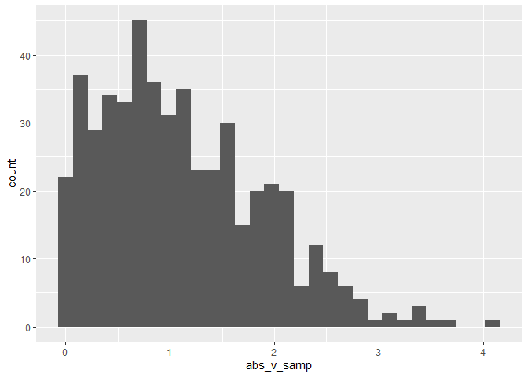

Simple but really neat document
================
2024-09-10

I loaded necessary packages (e.g. `tidyverse`).

I’m an R Markdown document!

Types for output: html, pdf, word, github…

# Section 1

Here’s a **code chunk** that samples from a *normal distribution*:

``` r
samp = rnorm(100)
length(samp)
```

    ## [1] 100

# Section 2

I can take the mean of the sample, too! The mean is -0.0345865.

# Learning assessment

This is code for the learning assessment at P8105. Get rid of message:
message = FALSE.

``` r
la_df = 
  tibble(
    norm_samp = rnorm(n = 500, mean = 1),
    samp_g0 = norm_samp > 0,
    abs_v_samp = abs(norm_samp)
  )

ggplot(la_df, aes(x = abs_v_samp)) +
  geom_histogram()
```

<!-- -->

Here’s code to create a histogram.

``` r
ggplot(la_df, aes(x = abs_v_samp)) +
  geom_histogram()
```

## Text formatting

*italic* or *italic* **bold** or **bold** `code` superscript<sup>2</sup>
and subscript<sub>2</sub>

## Headings

# 1st Level Header

## 2nd Level Header

### 3rd Level Header

## Lists

- Bulleted list item 1

- Item 2

  - Item 2a

  - Item 2b

1.  Numbered list item 1

2.  Item 2. The numbers are incremented automatically in the output.

## Tables

| First Header | Second Header |
|--------------|---------------|
| Content Cell | Content Cell  |
| Content Cell | Content Cell  |
